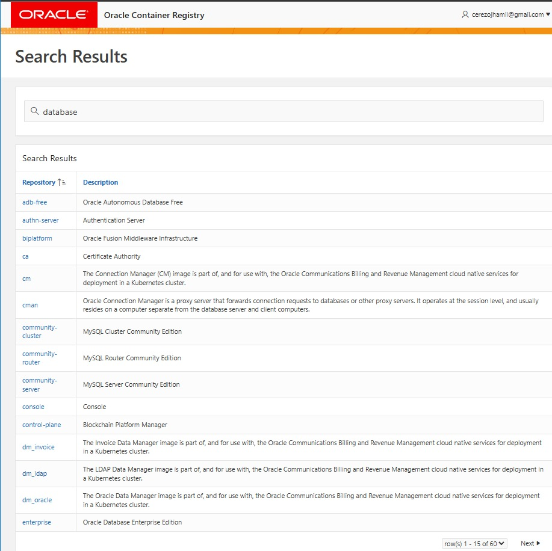

# Guía Completa para Crear un Contenedor de Oracle Database con Docker
## Requisitos
- Docker instalado en tu sistema, funcional.
- Cuenta en Oracle Cloud

## 1️⃣ Crear una Cuenta en Oracle Cloud

Para descargar la imagen de Oracle Database, necesitas una cuenta en Oracle Container Registry.

1. Ve a [Oracle Container Registry](https://container-registry.oracle.com/).
2. Crea una cuenta gratuita o inicia sesión si ya tienes una.
3. Acepta los términos de licencia de Oracle Database en la sección "Database".
4. Verifica tu cuenta a través del correo electrónico recibido.
6. En el buscador de oracle ingresa `database` y en la parte final selecciona `enterprise`

7. Luego en la parte derecha presiona `continue`, esto te llevara a los `terminos y condiciones`.


8. Aceptar los terminos y condiciones para poder usar las imagenes de Oracle.


## 2️⃣ Crear la carpeta del Proyecto
Crear una carpeta en el escritorio, la cual contendra los contenedores que se utilizaran para el proyecto (Practica), la misma carpeta abrir con `terminal` y dentro de esta carpeta ejecutar los siguientes pasos.

## 3️⃣ Iniciar Sesión en el Registro de Oracle desde el terminal

Antes de descargar la imagen de Oracle Database, necesitas abrir `Docker Desktop` y luego iniciar sesión en Docker desde el `terminal` donde se ecuentra el proyecto con tus credenciales de Oracle:

```sh
docker login container-registry.oracle.com
```

Introduce tu usuario y contraseña de Oracle cuando te lo solicite.

## 4️⃣ Crear un Archivo docker-compose.yml
En el `terminal` donde se encuentra el proyecto ejecutar el siguiente comando:
```sh
code .
```
Este comando abrira el editor de `VS CODE`, una vez en vs code crear un archivo llamado `docker-compose.yml` y agregar el siguiente contenido:
```yaml
services:

nginx:
  image: nginx:latest
  container_name: mi_nginx
  ports:
    - "8080:80"
  volumes:
    - ./index.html:/usr/share/nginx/html/index.html
  networks:
    - app_network  # Se une a la red personalizada

oracle:
  image: container-registry.oracle.com/database/enterprise:latest
  container_name: oracle_db
  restart: always
  ports:
    - "1521:1521"  # Puerto de Oracle para conexiones SQL*Net
    - "5500:5500"  # Puerto de Oracle EM Express
  environment:
    - ORACLE_SID=ORCLCDB
    - ORACLE_PDB=ORCLPDB1 #Nombre del servicio
    - ORACLE_PWD=${ORACLE_PWD}  # Se usa un archivo .env para seguridad
    - ORACLE_CHARACTERSET=AL32UTF8
  volumes:
    - oracle_data:/opt/oracle/oradata
  networks:
    - app_network  # Se une a la red personalizada

volumes:
oracle_data:
nginx_data:  # Agregamos un volumen para posibles archivos de Nginx

networks:
app_network:  # Red para comunicación entre servicios
  driver: bridge
```

## 5️⃣ Crear un Archivo .env para Variables de Entorno
Crea un archivo `.env` en la misma carpeta del proyecto,
dentro del archivo añadir la siguiente línea:

```sh
ORACLE_PWD=MiSuperClaveSegura
```
## 6️⃣ Iniciar los Contenedores
Ejecuta el siguiente comando en el `terminal` del proyecto para levantar los servicios definidos en el archivo `docker-compose.yml`:
```sh
docker-compose up -d
```
Para verificar que los contenedores están corriendo ejecutar:
```sh
docker ps
```
# Acceder a la basee de datos directamente desde el contenedor:
Ejecutar el siguiente comando desde el `terminal`:
```sh
docker exec -it oracle_db sqlplus sys/MiSuperClaveSegura as sysdba
```

## 1️⃣ Verificar las bases de datos disponibles
Ejecuta este comando para ver los nombres de los Pluggable Databases (PDBs):
```sh
SHOW PDBS;
```
Verás algo como esto:

|   CON_ID   |   CON_NAME   |
|------------|--------------|
|      2     |   PDB$SEED   |
|      3     |   ORCLPDB1   |

El PDB que nos interesa aquí es ORCLPDB1.

## 2️⃣ Conectarse al Pluggable Database (PDB)
Ejecuta este comando en SQL*Plus dentro el contenedor:
```sh
ALTER SESSION SET CONTAINER = ORCLPDB1;
```
## 3️⃣ Crear un usuario para usar la base de datos
Ahora que estás dentro del PDB, puedes crear un usuario normalmente, ejecutar linea por linea los siguientes comandos:
```sql
CREATE USER pepe IDENTIFIED BY pepe1234;
GRANT CONNECT, RESOURCE TO pepe;
ALTER USER pepe QUOTA UNLIMITED ON USERS;
```
## 4️⃣ Conectarse con el nuevo usuario
Sal de SQL*Plus (contenedor) con EXIT; luego ejecuta el siguiente comando en el `terminal` para acceder a la base de datos con el nuevo usuario creado:
```sh
docker exec -it oracle_db sqlplus pepe/pepe1234@ORCLPDB1
```

# Crear una tabla en la base de datos dentro el contenedor
## 1️⃣Crear una tabla:
Para crear una tabla en Oracle, usa el siguiente comando SQL. Asegúrate de estar en el esquema correcto `usuario` donde quieres crear la tabla.

```sql
CREATE TABLE productos (
    id_producto NUMBER PRIMARY KEY,
    nombre VARCHAR2(100),
    precio NUMBER,
    cantidad NUMBER
);
```
## 2️⃣ Insertar datos en la tabla:
Una vez que la tabla ha sido creada, puedes insertar datos con el siguiente comando SQL:

```sql
INSERT INTO productos (id_producto, nombre, precio, cantidad)
VALUES (1, 'Producto A', 100, 50);

INSERT INTO productos (id_producto, nombre, precio, cantidad)
VALUES (2, 'Producto B', 150, 30);
```
## 3️⃣ Ver la base de datos y las tablas:
Ver las bases de datos disponibles (esquemas):

```sql
SELECT * FROM all_users;
```
Ver las tablas en tu esquema:

```sql
SELECT table_name FROM user_tables;
```

## 4️⃣Ver el contenido de una tabla:
Para ver el contenido de la tabla, puedes hacer una consulta `SELECT` como esta:

```sql
SELECT * FROM productos;
```
Esto te mostrará todos los registros en la tabla `productos`.

## 5️⃣Salir de SQL*Plus y del contenedor:
Para salir de SQL*Plus:

```sql
EXIT;
```
Para salir del contenedor Docker:

```bash
exit
```
Con estos pasos podrás crear tu tabla, llenarla con datos y hacer consultas, todo dentro de un `contenedor Docker` con Oracle Database.

# Acceder a Oracle Database desde un entorno grafico con (Oracle SQL Developer Extension for VSCode)

Para conectarte a la base de datos Oracle desde una herramienta externa como SQL Developer
crea una nueva conexión con los siguientes parámetros (revisar estos datos en docker-compose.yml):

```sh
Host: localhost
Puerto: 1521
Nombre del servicio: ORCLPDB1
Usuario: user
```

# Iniciar, Detener y Eliminar los Contenedores
Iniciar los contenedores definidos en docker-compose.yml:
```sh
docker-compose up -d
```
Para detener todos los contenedores activos:
```sh
docker stop $(docker ps -q)
```
Si deseas eliminar los volúmenes de datos para empezar de nuevo:
```sh
docker-compose down -v
```

# 🚀 Conclusión

Con estos pasos, ahora tienes un contenedor de Oracle Database funcionando junto con Nginx. Puedes usar esta configuración para desarrollar aplicaciones que requieran una base de datos Oracle sin necesidad de instalar Oracle Database en tu sistema.
